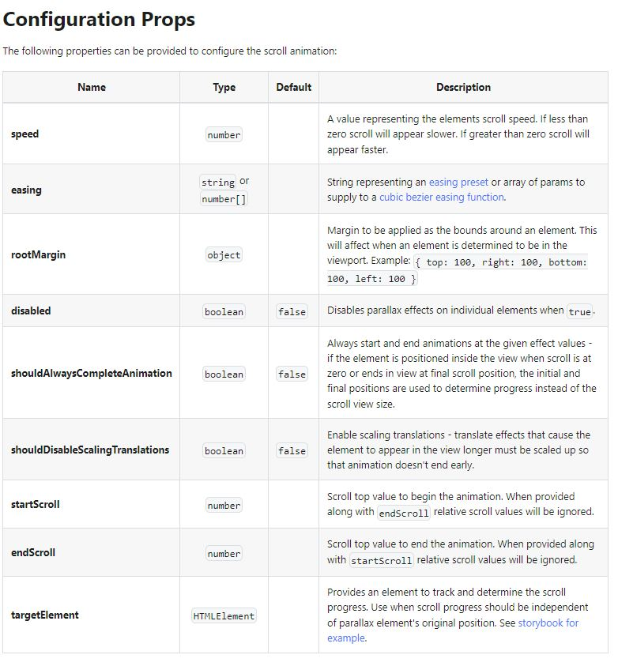

## The React-Scroll-Parallax Hook

React hooks and components to create parallax scroll effects for banners, images or any other DOM elements. Utilizes Parallax Controller to add vertical or horizontal scrolling based effects to elements. Optimized to reduce jank on scroll.

I am going to be learning about how this npm package works and trying to implement some cool examples

## Install

- `npm i react-scroll-parallax` -> Start by installing the package as a dependency

## Usage - Baby Steps

#### Wrap Our Top Level Component

We must start off by wrapping our top level component (<App /> in this case) in the <ParallaxProvider />

```js
import { ParallaxProvider } from "react-scroll-parallax";

const App = () => {
  return (
    <ParallaxProvider>
      <AppRoutes />
    </ParallaxProvider>
  );
};
```

This will provide all the necessary access through the React context API to the Parallax controller

#### Start Creating Effects

There are two ways we can use this package:

1.  With the useParallax() hook
2.  With the <Parallax> Component

##### With useParallax()

We can now import useParallax in any component we like, that is contained within the provider.

```js
import { useParallax } from "react-scroll-parallax";

const Component = () => {
  const { ref } = useParallax({ speed: 10 });
  return <div ref={ref} className="my-thing" />;
};
```

The hook will apply the effects styles directly to the element that the `ref` is attached

##### With <Parallax>

```js
import { Parallax } from "react-scroll-parallax";

const Component = () => (
  <Parallax translateY={[-20, 20]}>
    <div className="my-thing" />
  </Parallax>
);
```

Here's an example that will transform the element on the translateY axis starting at -20% and ending at 20% ([-20, 20] \*percent is assumed with no provided unit).

Note that the component will apply the div managed by the component and NOT the children. All other non-parallax props will be passed through to the <div>. Example with style and className:

```jsx
<Parallax style={{ background: 'blue' }} className="test" />

OUTPUT HTML

<div style="background: blue" className="test"></div>
```

#### Props

We can pass props in both scernarios

##### useParallax()

```jsx
useParallax({
  speed: -10,
  ...props,
});
```

##### Parallax

```jsx
<Parallax speed={-10} {...props} />
```

#### Types of Props




#### ParallaxBanners

#### Advanced ParallaxBanners

1. You are not limited to using only speed to control movement. In this example translateY is defined with custom start and end values. This is helpful when the banner starts at the top of the page.

2. Setting shouldAlwaysCompleteAnimation ensures that the animation begins at the initial position in the view, and since this banner is placed at the top of the page this option is enabled.
3. Additional scale effects are used to further enhance the scenes depth and are also provided individual easing values.
4. Certain layers set expanded to false. This is because they don't move or have no edge that would appear visible so there is no need to expand them.
5. Lastly, a gradient overlay is added to dim the scene with an opacity transition.
